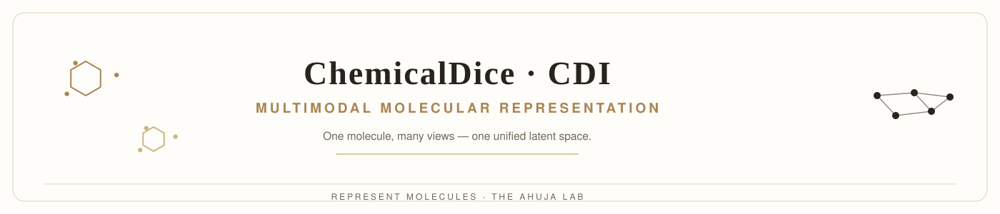

<p align="center">
  
</p>

> **One molecule, many views — one unified latent space.** ChemicalDice / CDI is a deep
> learning framework that integrates complementary molecular representations into a single,
> information-rich chemical embedding.

---

## Why this problem matters

A molecule is not one thing. It has physicochemical properties, a graph structure, a language
(SMILES), a bioactivity history, a 2D shape, and a quantum-chemical character. Models built on
any single view see only part of the molecule — and generalize only as far as that view allows.
Molecular machine learning needs representations that capture chemical, structural *and*
biological semantics simultaneously.

## Scientific question

*How should a molecule be represented when no single molecular description captures all of its
biology and chemistry?*

## Concept

<div align="center">
  
</div>

## What the system does

CDI performs unsupervised integration of **five complementary molecular embeddings**:

- **Bioactivity signatures**
- **Language model embeddings**
- **Graph-derived representations**
- **Physicochemical profiles**
- **2D molecular image features**

Each compound's five feature types are combined into a **single latent embedding** that captures
chemical, structural, and biological semantics. These embeddings can be used directly for
**QSAR modeling, virtual screening, drug–target interaction prediction, and bioactivity
clustering** — and are distilled into a deployable molecular representation accessible from
SMILES.

## Main methodological contributions

- Unsupervised integration of five heterogeneous molecular views into one latent space
- SMILES-based distillation → deployable representation for arbitrary query molecules
- Production interfaces in **Python** and **R**
- **CDI Bot** — a containerised, LLM-powered conversational interface to the embedding platform

## Benchmark & validation

- [Out-of-distribution analysis](https://the-ahuja-lab.github.io/ChemicalDice/ood_analysis)
- [Ablation analysis](https://the-ahuja-lab.github.io/ChemicalDice/ablation_analysis)
- [Architecture documentation](https://the-ahuja-lab.github.io/ChemicalDice/architecture)

## Installation

**Python prerequisites:** Python ≥ 3.8, RDKit ≥ 2022.3.1, pandas ≥ 1.4.3, numpy ≥ 1.20.3, tqdm ≥ 4.65, requests ≥ 2.32.4

```bash
pip install rdkit pandas numpy tqdm requests
pip install ChemicalDice
```

**R interface** (from GitHub):

```r
install.packages(c("httr", "data.table", "progress", "jsonlite", "reticulate", "curl", "remotes"))
remotes::install_github("the-ahuja-lab/ChemicalDice", subdir = "R-package")
```

## Quick start

```python
from ChemicalDice import smiles_to_embeddings

# Generate embeddings from a CSV with a 'SMILES' column
CDI_embeddings = smiles_to_embeddings.collect_features_from_csv(
    filepath="smiles.csv",
    convert_to_canonical=False
)
CDI_embeddings.to_csv("CDI_embeddings.csv", index=False)
```

Each row is validated (invalid SMILES flagged and skipped), optionally canonicalised, and
converted into the unified feature vector. The standardized output plugs directly into QSAR,
clustering, virtual screening, or ML pipelines.

## Examples

| Interface | Demo |
|---|---|
| Python | [Open in Colab](https://colab.research.google.com/drive/1I6vQ_7SlhagbnXVlg4btWoYal_NcCElt?usp=sharing) |
| R | [Open in Colab](https://colab.research.google.com/drive/1DpHSlauU-Z-Xj3b3dycSgGImFA4ua4g9?usp=sharing) |

## Reproducibility

- [Complete documentation](https://the-ahuja-lab.github.io/ChemicalDice/) (architecture, API reference, deployment, OOD & ablation analyses)
- [Training data & notebooks](https://github.com/the-ahuja-lab/ChemicalDice/tree/main/datasets) and [training scripts](https://github.com/the-ahuja-lab/ChemicalDice/tree/main/training)
- CDI Bot demo: [watch](https://www.youtube.com/watch?v=3NaBBTviEsA)

> **Note:** the CSV input is modified in place during processing — always work on a copy of your original data.

## Citation

If you use Chemical Dice Integrator, please cite the software:

```text
Ahuja Lab. (2025). Chemical Dice Integrator (CDI) — a deep learning framework for
integrating heterogeneous molecular representations into a unified chemical embedding
space. https://github.com/the-ahuja-lab/ChemicalDice
```

Machine-readable metadata: [`CITATION.cff`](CITATION.cff).

## Team

[The Ahuja Lab](https://github.com/the-ahuja-lab) — computational biology and molecular AI.

## License

MIT — see [`LICENSE.txt`](License).
