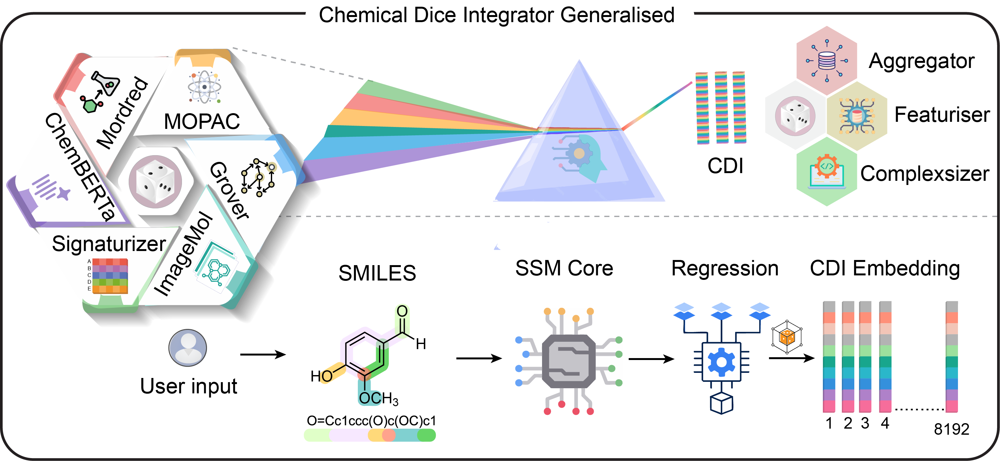

# Chemical Dice
ChemicalDice is a deep learning featurizer developed using unsupervised 
learning on the ChEMBL database. It captures six distinct molecular 
representations: quantum descriptors, bioactivity profiles, language model
embeddings, graph-based features, physicochemical properties, and 
2D image-based features. ChemicalDice takes SMILES strings as input and 
generates comprehensive embeddings for each molecule, enabling robust and 
versatile molecular characterization for downstream cheminformatics and 
bioinformatics applications.

ChemicalDice is available as both Python and R packages, making it useful
for all users.


---

<br>
<div align="center">
  
</div>
<br>

<p align="center">
  
  
  
  <a href="https://github.com/the-ahuja-lab/inertrope">
    
  </a>
</p>

---

## ⚙️ Installation

### 🧱 Using  Python

[Get Started with ChemicalDice R](https://github.com/the-ahuja-lab/ChemicalDice/tree/main/python-package)

Install packages
----------------

To use the **ChemicalDice** package, you need to install it along with
its dependencies. You can install ChemicalDice and its dependencies
using the following commands:

.. code:: bash

   pip install numpy pandas tqdm rdkit 
   pip install -i https://test.pypi.org/simple/ ChemicalDice


Calculation of Embeddings
--------------------------

.. code:: python

   # SMILES column should be present in the CSV file.
   #example CSV file:
   # SMILES,other_column1,other_column2
   # CC(=O)OC1=CC=CC=C1C(=O)O,1,2
   # C1=CC=CC=C1,3,4
   # C1=CC=C(C=C1)C(=O)O,1,2
   from ChemicalDice import  smiles_to_embeddings
   embeddings = smiles_to_embeddings.collect_features_from_csv(
      filepath="smiles.csv",
      key = "API_KEY",  # Replace with your actual API key
   )

[Get Started with ChemicalDice Python](https://github.com/the-ahuja-lab/ChemicalDice/tree/main/R-package)
# R Package 
## Overview
This package provides an R interface to validate, canonicalize, and make embeddings from SMILES using ChemicalDice API. It uses RDKit (via reticulate) for SMILES validation and canonicalization, and streams CSV files for feature extraction.

## Installation

### System Requirements
- R (>= 4.0)
- Python (with RDKit installed)
- The following R packages: `httr`, `data.table`, `progress`, `jsonlite`, `reticulate`, `curl`

### Install R dependencies
```r
install.packages(c("httr", "data.table", "progress", "jsonlite", "reticulate","curl"))
remotes::install_github("the-ahuja-lab/ChemicalDice@main", subdir = "R-package")

```

### Python & RDKit setup
You must have Python and RDKit installed. The easiest way is via conda:
```sh
conda create -n chemicaldice python=3.9 rdkit -c conda-forge
```

## Usage

Load libraries, point reticulate to your conda environment and import rdkit:
```r
library(ChemicalDice)
library(reticulate)
use_condaenv("chemicaldice", required = TRUE)
py_require("rdkit")
rdkit <- import("rdkit.Chem", convert = TRUE)
```

### Feature Extraction from CSV
Your CSV must have a column named `SMILES`.
```r
features <- collect_features_from_csv("smiles.csv",key = "API_KEY")
```

- The function will validate all SMILES, overwrite the CSV with canonical SMILES, and stream the file to the server.
- Returns a numeric matrix of features (rows = molecules, columns = features).


