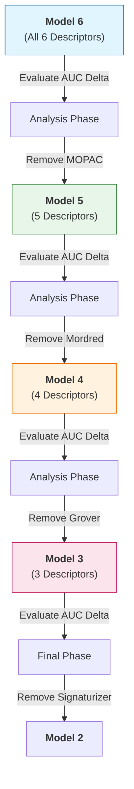

# Ablation Analysis

The **Ablation Analysis** was conducted to evaluate the individual contributions of each molecular modality to the overall information density of the ChemicalDice Integrator (CDI). By systematically removing descriptors and measuring the impact on the model's learning capacity, we can quantify the synergistic value of the multimodal approach.

### 1. Methodology
The study follows a "descending complexity" protocol. Starting from the full 6-modality ensemble (Model 6), descriptors are removed one by one. After each removal, the model is re-trained, and its learning efficiency is measured using the delta between encoder and decoder loss curves: **AUC(Encoder) - AUC(Decoder)**. 

This metric quantifies the information "compression efficiency" and the semantic alignment between the integrated latent space and the reconstructed modalities.

### 2. Ablation Workflow



### 3. Key Observations
* **Information Redundancy vs. Synergy**: Each removal results in an increase in the Reconstruction Loss AUC, indicating that every modality provides unique semantic information that cannot be fully compensated for by the remaining descriptors.
* **Critical Modalities**: The removal of MOPAC (Quantum) and Mordred (Physicochemical) typically results in the most significant shifts in the early-stage loss landscape, highlighting their foundational role in defining molecular geometry within the latent space.
* **Stability**: The hierarchical architecture remains stable even as input dimensionality decreases, though the "Super-Embedding" naturally loses some of its multi-perspective resolution.

---

### Python API Automation
You can automate the entire ablation study using a simple Python loop. This allows for systematic evaluation of every model configuration from Model 6 down to Model 2.

```python
from ChemicalDice.training.basic_model import train_basic_cdi

# Define the full set of modalities
all_manifolds = [
    "data/mordred.h5", 
    "data/Grover.h5", 
    "data/Chemberta.h5", 
    "data/Signaturizer.h5", 
    "data/mopac.h5", 
    "data/ImageMol.h5"
]

# Systematically remove descriptors (Ablation Loop)
# This iterates through Model 6, 5, 4, 3, and 2
for i in range(len(all_manifolds), 1, -1):
    current_set = all_manifolds[:i]
    print(f"Training Model {i} with {len(current_set)} descriptors...")
    
    model = train_basic_cdi(
        h5_file_paths=current_set,
        num_epochs=50,
        batch_size=32,
        learning_rate=0.001
    )
    # Save or evaluate the model here
```
