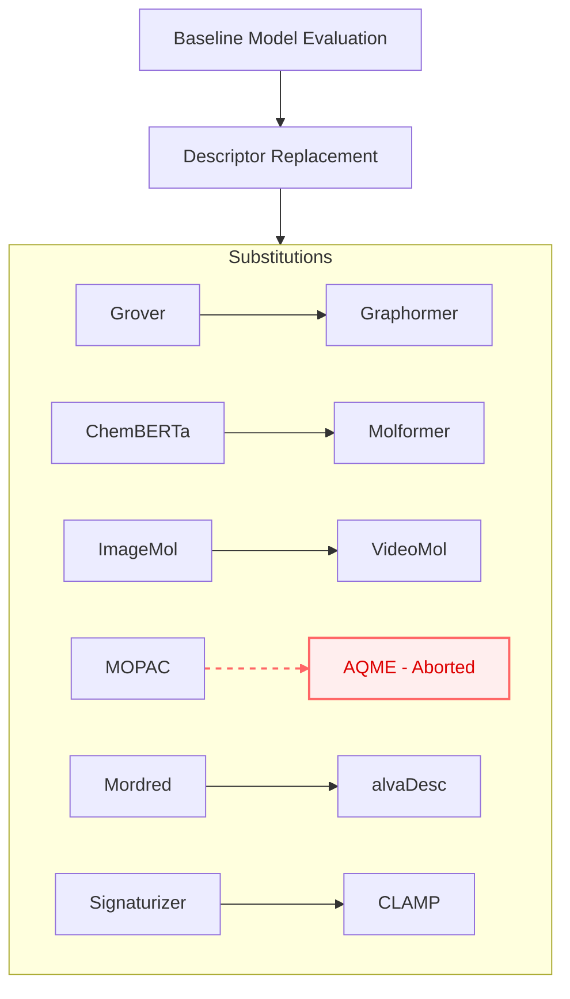

# Replacement Studies

Replacement studies are conducted on a **representative 10% ChEMBL subset** to evaluate the modularity and upgradability of the CDI-Basic framework. The study follows a systematic protocol where each of the six original molecular modalities is replaced one by one with a alternative descriptor to measure performance deltas.

### Substitution Roadmap



---

## Overview & General Workflow

For each pipeline, the workflow generally consists of:
1. **Activating the relevant environment.**
2. **Generating Data:** Running a bash script to launch the embedding/descriptor generation script (`run_*.sh`). Output is typically logged in a `logs_new/` directory.
3. **Merging Chunks:** Merging the output chunks into a single `.npz` file (`merge_*_chunks.py`).
4. **Post-Processing:** Running a final script (`final.py`) to process outputs, check for missing molecule IDs, and filter the final embeddings.

---

## AlvaDesc 
**AlvaDesc** is a comprehensive cheminformatics tool for generating thousands of high-quality 2D and 3D molecular descriptors and fingerprints, providing meaningful numerical representations for machine learning and QSAR workflows.

**Official Reference:** [alvaDesc](https://www.alvascience.com/alvadesc/)

### Requirements
* Python 3.x
* `alvadescpy` package (`pip install alvadescpy`)
* Licensed alvaDesc installation
* `alvadesc` conda environment

### Execution
```bash
# 1. Activate the conda environment
conda activate alvadesc

# 2. Run the pipeline
bash run_alvadesc_new.sh

# 3. Merge output chunks
python merge_alvadesc_chunks.py

# 4. Post-processing / analysis
python final.py
```

### Script Details
* **final.py**: Processes AlvaDesc output, extracts failed molecule IDs from logs, and loads/saves descriptor arrays.
* **merge_alvadesc_chunks.py**: Merges multiple chunked `.npz` files of descriptors into a single final `.npz` file.
* **run_alvadesc_pipeline_new.py**: Main Python pipeline for computing descriptors from SMILES using AlvaDesc, with logging and multiprocessing support.

---

## CLAMP 
**Contrastive Language-Assay Molecule Pre-Training**
**CLAMP** is a multi-modal framework trained on molecule-bioassay pairs, enabling zero-shot molecular property prediction by processing natural language assay descriptions.

**Official Reference:** [CLAMP GitHub](https://github.com/ml-jku/clamp)
### Requirements
* Python 3.x
* CLAMP package installed via pip
* Dependencies: PyTorch, RDKit, etc.

### Execution
```bash
# 1. Set up and compute embeddings
bash run_clamp.sh

# 2. Merge chunked embeddings
python merge_clamp_chunks.py

# 3. Check for missing IDs and filter final embeddings
python final.py
```

### Script Details
* **clamp_embeddings.py**: Main script to compute CLAMP embeddings for a list of molecules from a CSV file. Handles chunking and logging.
* **merge_clamp_chunks.py**: Merges all chunked `.npz` embedding files into a single final `.npz` file.

---

## Graphormer
**Graphormer** is a specialized deep learning framework designed to model molecular graphs efficiently, accelerating research in drug and material discovery.

**Official Reference:** [Graphormer GitHub](https://github.com/microsoft/Graphormer)

### Model Details
Uses the pretrained model `clefourrier/graphormer-base-pcqm4mv1` from Hugging Face.

### Execution
```bash
# 1. Setup and generate embeddings
bash run_graphormer_embeddings.sh

# 2. Merge chunked embeddings
python merge_graphormer_chunks.py

# 3. Check for missing IDs and filter final embeddings
python final.py
```

### Script Details
* **graphormer_code.py**: Main script to compute Graphormer embeddings from a CSV file.
* **merge_graphormer_chunks.py**: Merges all chunked `.npz` embedding files.

---

## MolFormer
**MolFormer** is a large-scale chemical language model that leverages SMILES strings and a linear attention transformer to learn robust molecular representations from vast datasets.

**Official Reference:** [MolFormer GitHub](https://github.com/IBM/molformer)

### Model Details
Uses the pretrained model `ibm/MoLFormer-XL-both-10pct` from Hugging Face by default.

### Execution
```bash
# 1. Setup and generate embeddings
bash run_molformer_embeddings.sh

# 2. Merge chunked embeddings
python merge_molformer_chunks.py

# 3. Check for missing IDs and filter final embeddings
python final.py
```

---

## AQME (Quantum Descriptors)
**AQME** utilizes the QDESCP module and MORFEUS interface to automate the calculation of complex electronic and steric quantum descriptors from 3D molecular structures.

### Software Used
Uses the AQME package for conformer search and quantum descriptor calculation.

> [!WARNING]
> **Abortion Note:** During the replacement study, AQME descriptor calculation failed for a large number of molecules in the representative ChEMBL subset. Due to this high failure rate and subsequent data sparsity, AQME was **not used** as a functional replacement for MOPAC in the final analysis.

### Execution
```bash
# 1. Compute AQME quantum descriptors
bash run_aqme_pipeline.sh

# 2. Merge chunked descriptors
python merge_aqme_chunks.py
```

---

## VideoMol
**VideoMol** is a foundational model that represents molecules as dynamic videos, using self-supervised learning on millions of frames to capture intricate three-dimensional structural details.

**Official Reference:** [VideoMol GitHub](https://github.com/HongxinXiang/videomol)

### Model Details
Uses a ViT-based FramePredictor model with weights loaded from `ckpts/VideoMol_vit_small_patch16_224.pth`.

### Execution
```bash
# 1. Compute embeddings with precomputed video frames
bash run_videomol_pipeline.sh

# 2. Merge chunked embeddings
python merge_videomol_chunks.py

# 3. Check for missing IDs and filter final embeddings
python final.py
```

---

### Python API Automation
To evaluate the impact of each State-of-the-Art (SOTA) replacement, you can use a Python loop to iteratively substitute original modalities with their upgraded versions.

```python
from ChemicalDice.training.basic_model import train_dynamic_cdi

# Define the baseline (Original CDI-Basic Manifolds)
baseline_set = [
    "data/mordred.h5", "data/Grover.h5", "data/Chemberta.h5", 
    "data/Signaturizer.h5", "data/mopac.h5", "data/ImageMol.h5"
]

# Define the SOTA replacements
replacements = {
    "data/Grover.h5": "data/Graphormer.h5",
    "data/Chemberta.h5": "data/Molformer.h5",
    "data/ImageMol.h5": "data/VideoMol.h5",
    "data/mordred.h5": "data/alvadesc.h5",
    "data/Signaturizer.h5": "data/clamp.h5"
}

# 1. Train Baseline
print("Training Baseline Model...")
train_dynamic_cdi(h5_file_paths=baseline_set, num_epochs=50)

# 2. Iterative Replacement Loop
for original, sota in replacements.items():
    # Create a new set by replacing one modality
    experimental_set = [sota if x == original else x for x in baseline_set]
    
    print(f"Testing Replacement: {original} -> {sota}")
    model = train_dynamic_cdi(
        h5_file_paths=experimental_set,
        num_epochs=200,
        batch_size=64,
        learning_rate=0.005
    )
```
